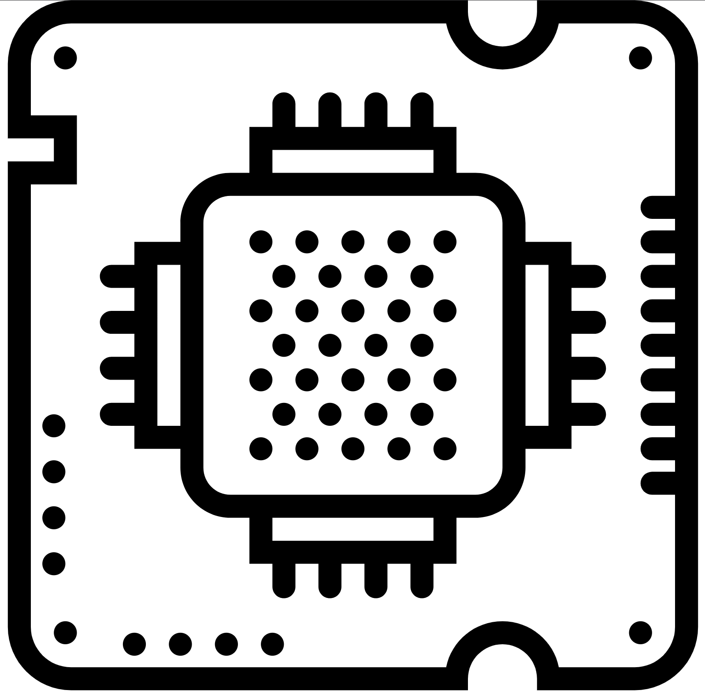
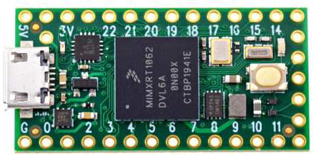
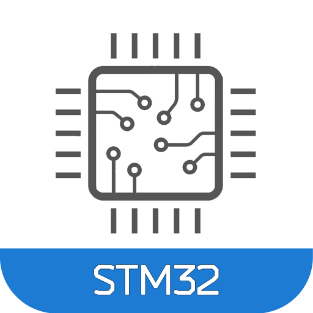
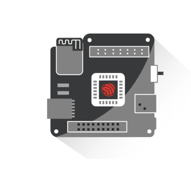
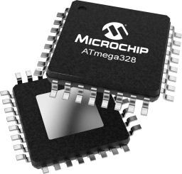

Hello! 👋 My name is Mervin Nguyen
=====================================================================================================================================

Embedded Software/Firmware Engineer
------------------------------------------------

* 🌍  I'm based in Orange County, California.
* 🖥️  See my portfolio at [mervin-nguyen.vercel.app](https://mervin-nguyen.vercel.app/)
* ✉️  You can contact me at [mervinnguyenembedded@gmail.com](mailto:mervinnguyenembedded@gmail.com).
* 🧠  I'm building a production-grade SPI driver in C++ with deterministic timing, DMA-backed transfers, and thread-safe bus arbitration.
* ⚙️  I'm designing a custom RTOS from scratch on ARM Cortex-M, implementing task scheduling, context switching, and priority-based preemption.
* 🚀  I'm currently deepening my expertise in real-time systems (scheduling, ISR design, latency optimization) and low-level drivers (SPI, I2C, UART, CAN with DMA and interrupt-driven architectures).
* 🤝  Open to collaborating on systems involving bare-metal and RTOS-based firmware, embedded Linux, automotive/EV embedded platforms, and edge AI integration.

📊 **This week I spent my time on:**
<!--START_SECTION:waka-->

```txt
Embedded Systems Interview Preparation, Fiber-optic drone project (Photon Flight), SPI driver for the Bosch BME280 sensor, and M-Core RTOS from scratch (STM32F411).
```

### Skills

<table>
  <tr>
    <td><a href="https://docs.microsoft.com/en-us/cpp/?view=msvc-170"></a></td>
    <td><a href="https://docs.microsoft.com/en-us/cpp/?view=msvc-170"></a></td>
    <td><a href="#"></a></td>
    <td><a href="https://git-scm.com/"></a></td>
    <td><a href="https://www.python.org/"></a></td>
    <td><a href="https://store.arduino.cc/"></a></td>
    <td><a href="https://www.linux.org"></a></td>
    <td><a href="https://www.raspberrypi.org/"></a></td>
    <td><a href="#"></a></td>
    <td><a href="#"></a></td>
    <td><a href="#"></a></td>
    <td><a href="#"></a></td>
    <td><a href="https://www.w3schools.com/css/"></a></td>
    <td><a href="https://www.java.com"></a></td>
    <td><a href="https://developer.mozilla.org/en-US/docs/Web/JavaScript"></a></td>
    <td><a href="https://tailwindcss.com/"></a></td>
    <td><a href="https://cmake.org/"></a></td>
  </tr>
</table>                                                                                                                                                                                             
</p>

<h3>My latest posts and interactions</h3>
<ul>
  <li><a href="https://www.linkedin.com/posts/mervin-nguyen_this-past-week-our-senior-design-project-activity-7438979974814064640-KCb8?utm_source=share&utm_medium=member_desktop&rcm=ACoAADrvWRcB__mYgfW-FRDnI5xB_tYckwcF2QQ"><b>Photon Flight – Fiber-Optic Drone Project | UCI Annual Design Review</b></a><br/><i>Led embedded systems development on Photon Flight, a fiber-optic tethered drone, securing 1st place out of ~200 teams at UCI's Annual Design Review.</i></li>
  <li><a href="https://www.linkedin.com/posts/anteater-electric-racing-5871942b7_if-you-havent-seen-it-already-the-results-activity-7269420443625762816-JfsX?utm_source=share&utm_medium=member_desktop"><b>Anteater Electric Racing Competition Results in Willow Springs</b></a><br/><i>Contributed to a 2nd place EV division finish at Willow Springs, a strong result for a test platform built on rigorous engineering and cross-functional collaboration.</i></li>
  <li><a href="https://www.linkedin.com/posts/sharitsundar_rtos-embedded-embeddedsystem-activity-7428693133162401792-GL-A?utm_source=share&utm_medium=member_desktop&rcm=ACoAADrvWRcB__mYgfW-FRDnI5xB_tYckwcF2QQ"><b>Core RTOS Mechanisms Every Real-Time Developer Should Know</b></a><br/><i>A deep dive into the primitives that underpin reliable real-time systems, task scheduling, mutexes, semaphores, queues, and event flags, and how to apply them correctly under timing constraints.</i></li>
  <li><a href="https://www.linkedin.com/posts/kalpant-ruikar-286a04205_embeddedsystems-embeddedengineering-iot-activity-7275733900721561600-Jxq6?utm_source=share&utm_medium=member_desktop"><b>#12. Tips to grow as an Embedded Software Engineer</b></a><br/><i>Deliberate career growth in embedded requires more than technical depth, active engagement with the broader engineering community accelerates both visibility and domain expertise.</i></li>
  <li><a href="https://www.linkedin.com/posts/jacobbeningo_3-modern-techniques-every-embedded-developer-activity-7272958506792554497-L-mx?utm_source=share&utm_medium=member_desktop"><b>3 Modern Techniques Every Embedded Developer Should Adopt</b></a><br/><i>Containerization, modern toolchains, and CI/CD practices are reshaping embedded development, engineers who adopt them early will define the next generation of scalable firmware architectures.</i></li>
  <li><a href="https://www.linkedin.com/posts/jacobbeningo_embedded-engineers-ignore-these-and-you-activity-7271871577401495553-0Sn3?utm_source=share&utm_medium=member_desktop"><b>Embedded Engineers, ignore these and you will be left behind in 2025</b></a><br/><i>Scalability in embedded systems demands intentional architectural decisions, layered, modular design patterns are no longer optional for engineers building production-grade firmware.</i></li>
  <li><a href="https://www.linkedin.com/posts/sagar-kanjariya_task-states-context-switching-ugcPost-7270632155515355136-sFbC?utm_source=share&utm_medium=member_desktop"><b>Understanding Task States & Context Switching</b></a><br/><i>Mastering the FreeRTOS task state machine: Ready, Running, Blocked, Suspended is foundational to writing deterministic, CPU-efficient firmware in resource-constrained environments.</i></li>


<br/>Currently, the weather is: <b>69°F, <i>Partly cloudy</i></b></br>Today, the sun rose at <b>06:09</b> and sets at <b>19:29</b>.</p>

### Socials

<p align="left"> <a href="https://www.github.com/mervinnguyen" target="_blank" rel="noreferrer"> <picture> <source media="(prefers-color-scheme: dark)" srcset="https://raw.githubusercontent.com/danielcranney/readme-generator/main/public/icons/socials/github-dark.svg" /> <source media="(prefers-color-scheme: light)" srcset="https://raw.githubusercontent.com/danielcranney/readme-generator/main/public/icons/socials/github.svg" />  </picture> </a> <a href="https://www.linkedin.com/in/mervin-nguyen" target="_blank" rel="noreferrer"> <picture> <source media="(prefers-color-scheme: dark)" srcset="https://raw.githubusercontent.com/danielcranney/readme-generator/main/public/icons/socials/linkedin-dark.svg" /> <source media="(prefers-color-scheme: light)" srcset="https://raw.githubusercontent.com/danielcranney/readme-generator/main/public/icons/socials/linkedin.svg" />  </picture> </a></p>
